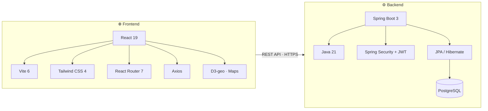
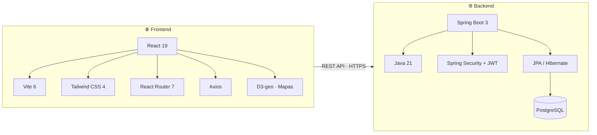

  

  # Forum Viajeros

  **🌐 [forumviajeros.com](https://forumviajeros.com)**

  ---
  🇬🇧 [English](#-about) &nbsp;·&nbsp; 🇪🇸 [Español](#-sobre-el-proyecto)

---

## 🇬🇧 About

A full-stack community platform for travellers: share experiences, mark visited countries on an interactive world map, compete in geography trivia and connect with fellow adventurers. Available in Spanish and English.

### 🚀 Try it live

| | |
|---|---|
| **URL** | https://forumviajeros.com |
| **Demo user** | `viajero_demo` |
| **Password** | `Demo1234!` |
| **Role** | USER |

### 👥 User Roles

| Role | Permissions |
|---|---|
| **USER** | Browse & create forums, posts and comments · Travel map · Trivia · Blog · Messaging |
| **MODERATOR** | All USER permissions · Moderate content · Manage posts and comments |
| **ADMIN** | Full access · User management · Admin dashboard · All settings |

### 🛠️ Tech Stack

### ✨ Features

- **Forums** — Organized by continent · Posts, comments, tags, image upload
- **Travel Map** — Mark 195 countries as visited, wishlist or lived-in · Personal statistics
- **Geography Trivia** — 4 game modes (Quick, Challenge, Daily, Infinite) · Global leaderboard
- **Travel Blog** — Articles with categories and search
- **Private Messaging** — Direct messages between users
- **i18n** — Spanish 🇪🇸 / English 🇬🇧

---

## 🇪🇸 Sobre el proyecto

Plataforma comunitaria full-stack para viajeros: comparte experiencias, marca en un mapa interactivo los países que has visitado, compite en trivia geográfica y conecta con otros aventureros. Disponible en español e inglés.

### 🚀 Pruébalo en vivo

| | |
|---|---|
| **URL** | https://forumviajeros.com |
| **Usuario demo** | `viajero_demo` |
| **Contraseña** | `Demo1234!` |
| **Rol** | USER |

### 👥 Roles de usuario

| Rol | Permisos |
|---|---|
| **USER** | Ver y crear foros, posts y comentarios · Mapa de viajes · Trivia · Blog · Mensajería |
| **MODERATOR** | Todo lo de USER · Moderar contenido · Gestionar posts y comentarios |
| **ADMIN** | Acceso completo · Gestión de usuarios · Panel de administración · Toda la configuración |

### 🛠️ Stack tecnológico

### ✨ Funcionalidades

- **Foros** — Organizados por continente · Posts, comentarios, tags, subida de imágenes
- **Mapa de viajes** — Marca 195 países como visitado, lista de deseos o donde has vivido · Estadísticas personales
- **Trivia geográfica** — 4 modos de juego (Rápido, Desafío, Diario, Infinito) · Ranking global
- **Blog de viajes** — Artículos con categorías y búsqueda
- **Mensajería privada** — Mensajes directos entre usuarios
- **i18n** — Español 🇪🇸 / Inglés 🇬🇧

---

  © 2026 Forum Viajeros · Educational project

